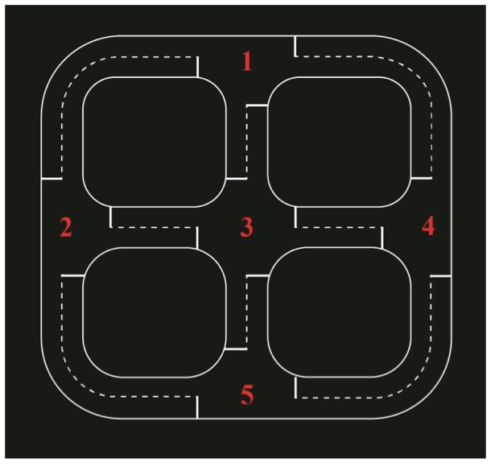
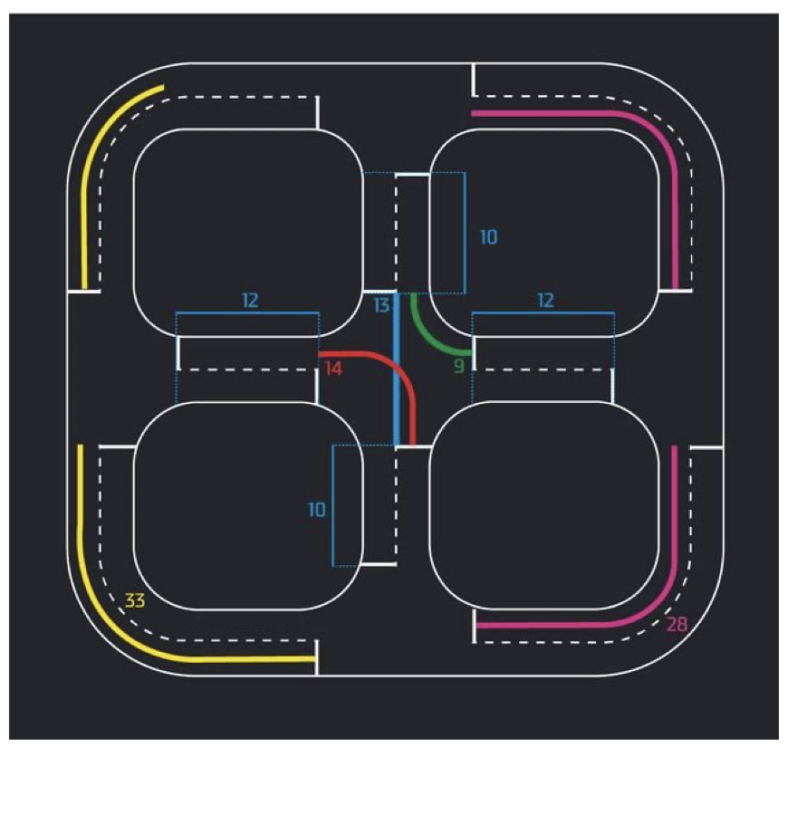

# Регламент проведения инженерного соревнования «Компьютерное зрение в навигации беспилотных роботизированных систем»

**Москва, 2026**

> Транскрипция официального PDF-регламента ([Регламент_Компьютерное_зрение_в_навигации_БРС.pdf](../source/Регламент_Компьютерное_зрение_в_навигации_БРС.pdf), 16 стр.).
> Текст сохранён по содержанию; орфография и опечатки оригинала помечены сносками вида `[sic]`.
> Собственные наблюдения и разбор — в отдельном файле [NOTES.md](NOTES.md).

---

## Оглавление

- [1. Общие положения](#1-общие-положения)
  - [1.1. Цели соревнования](#11-цели-соревнования)
  - [1.2. Задачи соревнования](#12-задачи-соревнования)
  - [1.3. Порядок организации соревнования](#13-порядок-организации-соревнования)
  - [1.4. Оборудование и программное обеспечение](#14-оборудование-и-программное-обеспечение)
- [2. Конкурсное задание](#2-конкурсное-задание)
  - [2.1. Общее описание задания очного этапа](#21-общее-описание-задания-очного-этапа)
  - [2.2. Подзадачи беспилотного автомобиля](#22-подзадачи-беспилотного-автомобиля)
  - [2.3. Подзадачи квадрокоптера](#23-подзадачи-квадрокоптера)
  - [2.4. Финальные испытания](#24-финальные-испытания)
  - [2.5. Оценка результатов и подведение итогов](#25-оценка-результатов-и-подведение-итогов)
  - [2.6. Порядок разрешения спорных вопросов](#26-порядок-разрешения-спорных-вопросов)
  - [2.7. Обратная связь, защита решения и собеседование](#27-обратная-связь-защита-решения-и-собеседование)
  - [2.8. Коммуникация с организаторами и общение между участниками](#28-коммуникация-с-организаторами-и-общение-между-участниками)
  - [2.9. Требования, права и обязанности участников](#29-требования-права-и-обязанности-участников)
- [Приложение № 1. Форма апелляции](#приложение--1-форма-апелляции)
- [Приложение № 2. Задание заочного этапа](#приложение--2-задание-заочного-этапа)

---

## 1. Общие положения

Настоящий регламент определяет порядок проведения и организации соревнования «Компьютерное зрение в навигации беспилотных роботизированных систем» (далее — соревнование).

Соревнование проводится в рамках проектно-образовательного интенсива **«Архипелаг»** и является самостоятельным соревнованием, проводимым в соответствии с данным регламентом.

Участники выполняют задания по программированию беспилотных аппаратов. За успешное выполнение заданий участники получают баллы. Первое место занимает команда с наибольшим количеством баллов. Остальные команды располагаются за ней в порядке убывания количества баллов.

Рабочим языком соревнования является русский язык.

Участие в соревновании означает согласие с настоящим регламентом. Принимая участие в соревновании, участник даёт своё согласие на обработку персональных данных в рамках действующего законодательства Российской Федерации.

### 1.1. Цели соревнования

Целью проведения соревнования является:

- развитие у участников компетенций по применению технологий компьютерного зрения и искусственного интеллекта в задачах беспилотных аппаратов;
- выявление специалистов в области программирования беспилотных аппаратов с наивысшим уровнем квалификации, способных к решению отраслевых задач в интересах технологического развития Российской Федерации;
- формирование профессионального сообщества, готового предлагать и реализовывать свои идеи в данном направлении.

Победа в соревновании может служить точкой успеха, которая усиливает мотивацию молодых людей развиваться именно в этой области, а также является стимулом для получения профильного профессионального образования.

### 1.2. Задачи соревнования

- определение лучших специалистов в области программирования беспилотных аппаратов по результатам проведения соревнований;
- выявление новых подходов к решению задач, поставленных в ходе соревнования, а также определение наиболее эффективных методов решения;
- повышение интереса к реализации собственных идей у участников соревнования.

### 1.3. Порядок организации соревнования

Соревнования проводятся в **2 этапа**: заочный (квалификационный отбор) и очный (финальный).

**Заочный этап** — квалификационный отбор, в ходе которого участники самостоятельно выполняют задания, направленные на проверку их компетенций. Описание заданий и материалы — в [Приложении № 2](#приложение--2-задание-заочного-этапа).

**Очный этап:**

- к участию допускаются команды в составе **не более 4 человек старше 14 лет**;
- задание выполняется командой **в течение трёх дней** в соответствии с расписанием работы площадки;
- команды могут сдавать решения задач и получать за них баллы;
- число попыток сдачи заданий ограничено **только временем доступа** к оборудованию и испытательным полигонам;
- **штрафы за номер успешной попытки отсутствуют**.

#### Механика лимита времени

Команды получают **одинаковый лимит времени** на выполнение попыток. Время из лимита расходуется в двух случаях:

1. **Команда выполняет попытку.** Из лимита вычитается столько времени, сколько команда потратила на попытку.
   *Пример:* команда № 3 потратила на попытку 10 минут → лимит команды № 3 уменьшается на 10 минут, лимиты остальных команд не меняются.

2. **Испытательный полигон простаивает** (ни одна команда не выполняет попытку). Время простоя делится на число команд с положительным остатком лимита и вычитается из каждого такого лимита.
   *Пример:* 10 команд имеют неисчерпанный лимит → через 10 минут простоя лимит каждой уменьшится на 1 минуту.
   *Пример:* 5 команд исчерпали время, ещё 5 имеют ненулевые лимиты → через 10 минут простоя лимиты оставшихся пяти уменьшатся на 2 минуты.

### 1.4. Оборудование и программное обеспечение

- Всё оборудование, необходимое для участия в заключительном этапе, участники получают **на площадке проведения**.
- **На площадке запрещено использовать личные компьютеры!**
- Разрешено использование смартфонов.
- Разрешено использовать материалы из сети «Интернет» и самостоятельно выбирать инструменты для решения задач. Следует выбирать инструменты, совместимые с программной и аппаратной частями предоставленного оборудования.
- Оборудование команды, выведенное из строя в результате действий участников, **не заменяется запасным**. Если во время тестовой или зачётной попытки устройство приходит в неисправное состояние, **время попытки не останавливается**.

---

## 2. Конкурсное задание

### 2.1. Общее описание задания очного этапа

Команде необходимо разработать **систему навигации БРС для совместной работы беспилотного автомобиля и квадрокоптера**. В рамках роевого мультисредного взаимодействия устройства системы должны осуществлять мониторинг и обслуживание сети мобильных солнечных электростанций на новой территории. Система будет испытываться в изменяющихся условиях внешней среды: возможно развёртывание новых станций, в то время как имеющиеся станции могут выходить из строя.

На старте работы системы у беспилотного наземного робототехнического комплекса (**НРТК**) имеется базовая карта с примерным расположением станций, требующая актуализации. Задача системы — сбор энергии от исправных станций и обновление данных о состоянии всех объектов.

**Роль квадрокоптера.** Служит средством пространственной осведомлённости НРТК. Автомобиль инициирует запуск дрона, после чего квадрокоптер выполняет воздушную разведку, обновляет виртуальную карту и обнаруживает электростанции, включая новые объекты. Обеспечивает объективный контроль состояния станций: визуально классифицирует их состояние как **исправное**, **повреждённое** или **требующее очистки от пыли**.

**Роль наземного беспилотника.** Осуществляет планирование маршрута с избеганием препятствий. На основе данных от дрона строит оптимальный путь через исправные станции и динамически корректирует траекторию при обнаружении препятствий или изменении статуса объектов.

**Дополнительный объективный контроль.** При приближении к станции автомобиль проводит детальный визуальный контроль элементов под солнечными панелями (кабельные коммуникации, электронные блоки). Эти элементы недоступны для обзора с воздуха, поэтому наземный комплекс подтверждает или уточняет статус станции перед забором энергии.

Устройства обмениваются телеметрией и результатами инспекции **в реальном времени**. Виртуальная карта обновляется по данным от каждого устройства системы, что обеспечивает **распределённую навигацию без ГНСС**.

После завершения инспекции и зарядки автомобиль следует в заранее заданную точку базы. Квадрокоптер выполняет финальную операцию: перемещается к покрытой пылью солнечной батарее и удаляет пыль воздушными потоками винтов, после чего приземляется на базе.

Задача разбита на **подзадачи** и **финальные испытания**. В подзадачах участвует только одно устройство системы; финальные испытания демонстрируют слаженную работу роя.

> Сдача подзадач, прохождение финальных испытаний и получение баллов возможны **в любой день соревнований**.

---

### 2.2. Подзадачи беспилотного автомобиля

В этом разделе действуют[^sic1] следующие положения:

- Дистанция от беспилотного автомобиля отсчитывается **от оси рулевых колёс** до **середины проекции объекта на правую линию дорожной разметки**;
- Беспилотный автомобиль должен двигаться по правой стороне дорожной разметки, **не вылетая более чем двумя колёсами** за пределы разметки.

[^sic1]: В оригинале — «действую».

#### 2.2.1. Коммутация электронных модулей

Необходимо изучить инструкцию по работе с моделью беспилотного автомобиля **АЙКАР**, соединить электронные модули согласно схеме подключения и продемонстрировать работу базового программного кода.

Для выполнения подзадачи необходимо:

- показать разработчику профиля скоммутированные электронные модули и получить разрешение на включение питания модели;
- запустить на модели АЙКАР базовый программный код, отладить его и продемонстрировать движение беспилотника по разметке разработчику профиля.

| Критерий | Баллы |
| --- | --- |
| Базовый код работает — беспилотник движется по разметке | **1 балл** |

#### 2.2.2. Запуск дрона при въезде на «новые территории»

Беспилотный автомобиль устанавливается на правую полосу дороги. В нескольких метрах по направлению движения расположен знак **«новые территории»**. По команде организатора участники запускают программу-приёмник на компьютере оператора и программу на борту автомобиля. Автомобиль должен подъехать к знаку, остановиться рядом с ним и отдать команду **«на взлёт»** квадрокоптеру.

Участники самостоятельно разрабатывают обе программы и **выбирают протокол обмена данными** между ними.

| Критерий | Баллы |
| --- | --- |
| Автомобиль доехал до знака «новые территории» и остановился на расстоянии **менее 15 см** от него<br>Программа-приёмник получает сообщение от автомобиля и выводит соответствующее сообщение в терминал | **5 баллов** |

#### 2.2.3. Движение до электростанции и остановка у неё

Автомобиль устанавливается на правую полосу дороги. В нескольких метрах по направлению движения расположена электростанция. По команде организатора участники запускают программу на борту автомобиля. Автомобиль должен доехать до электростанции и остановиться рядом с ней.

| Критерий | Баллы |
| --- | --- |
| Автомобиль доехал до электростанции[^sic2] и остановился на расстоянии **менее 15 см** от неё | **5 баллов** |

[^sic2]: В оригинале — «доехал до электростанции „новые территории“», очевидно копипаста из 2.2.2.

#### 2.2.4. Актуализация карты электростанций и построение маршрута по ней

По команде организатора участники запускают три программы:

- **передатчик** и **визуализатор** на компьютере оператора;
- программу на борту беспилотного автомобиля.

Сценарий:

1. Автомобиль отправляет визуализатору **базовую карту**. Визуализатор отображает карту местности с отмеченными электростанциями и их статусами.
2. Передатчик **с интервалом в 5 секунд** передаёт автомобилю **три пакета данных**:
   - **пакет 1** — обнаружение по конкретным координатам **новой станции**, не отмеченной на базовой карте;
   - **пакет 2** — **изменение статусов** станций, отмеченных на базовой карте;
   - **пакет 3** — **завершение воздушной разведки**.
3. Автомобиль принимает каждый пакет, обновляет данные о станциях и **транслирует первые два пакета визуализатору**.
4. После получения последнего пакета автомобиль **прокладывает маршрут через все исправные станции** и отправляет визуализатору пакет, кодирующий маршрут.
5. Визуализатор принимает пакеты, отображает изменения положения и состояния станций и наносит маршрут на карту.

| Критерий | Баллы |
| --- | --- |
| Обмен сообщениями происходит в порядке, описанном в условии задачи<br>Визуализатор последовательно и корректно отображает изменения в состоянии станций<br>Визуализатор корректно отображает маршрут беспилотного автомобиля | **6 баллов** |
| Координаты станции на карте визуализатора отличаются от реальных **менее чем на 30 см** | **4 балла** |

#### 2.2.5. Визуальный анализ состояния электростанции

Автомобиль устанавливается на правую полосу дороги. В нескольких метрах по направлению движения расположена электростанция. По команде организатора участники запускают программу на борту автомобиля и визуализатор на компьютере оператора. Автомобиль должен доехать до электростанции, **визуально определить, исправна ли станция**, остановиться рядом с ней и отправить обновлённый статус визуализатору. Визуализатор должен отобразить на карте обновлённый статус.

| Критерий | Баллы |
| --- | --- |
| Автомобиль доехал до электростанции, визуально определил её статус и остановился на расстоянии **менее 15 см** от неё<br>Визуализатор корректно отобразил изменившийся статус | **8 баллов** |

#### 2.2.6. Движение по маршруту и визуальный контроль состояния станций

По команде организатора участники запускают три программы:

- передатчик и визуализатор на компьютере оператора;
- программу на борту беспилотного автомобиля.

Автомобиль устанавливается на правую полосу дороги. В нескольких метрах по направлению движения расположен знак «новые территории». Автомобиль должен доехать до знака, остановиться рядом с ним и отдать команду **«на взлёт»** квадрокоптеру. После этого передатчик отправляет пакеты аналогично подзадаче [2.2.4](#224-актуализация-карты-электростанций-и-построение-маршрута-по-ней), и повторяется сценарий из неё. Автомобиль должен **проехать построенный маршрут** и **обновлять статусы станций**, встреченных по пути.

| Критерий | Баллы |
| --- | --- |
| Обмен сообщениями происходит в порядке, описанном в условии задачи<br>Визуализатор последовательно и корректно отображает изменения в состоянии станций по данным от квадрокоптера и автомобиля<br>Визуализатор корректно отображает маршрут беспилотного автомобиля | **16 баллов** |

---

### 2.3. Подзадачи квадрокоптера

#### 2.3.1. Облёт территории по команде от беспилотного автомобиля

По команде организатора участники запускают программу на борту квадрокоптера и программу-передатчик на компьютере оператора. Квадрокоптер получает сигнал от передатчика, выполняет взлёт, облёт территории и посадку на базе.

| Критерий | Баллы |
| --- | --- |
| Квадрокоптер принял сигнал от программы-передатчика, выполнил взлёт и облёт территории | **3 балла** |
| Квадрокоптер приземлился в пределах посадочной площадки[^sic3] | **2 балла** |

[^sic3]: В оригинале — «в пределах посадочной посадки».

#### 2.3.2. Обнаружение электростанций на новых территориях

В полётной зоне квадрокоптера располагаются **от 3 до 5 электростанций**. По команде организатора участники запускают визуализатор на компьютере оператора и программу на борту квадрокоптера. Квадрокоптер должен взлететь, облететь всю полётную зону и приземлиться на базе. В течение полёта дрон должен обнаруживать электростанции и отправлять визуализатору соответствующие сообщения; визуализатор наносит обнаруженные станции на карту.

| Критерий | Баллы |
| --- | --- |
| Квадрокоптер выполнил взлёт и облёт территории<br>Количество обнаруженных станций соответствует реальному<br>Визуализатор в режиме реального времени отображает на карте обнаруженные станции[^sic4] | **8 баллов** |
| Координаты станции на карте визуализатора отличаются от реальных **менее чем на 30 см** | **4 балла** |

[^sic4]: В оригинале — «обнаруженные здания».

#### 2.3.3. Визуальное определение статуса станции

В полётной зоне квадрокоптера располагаются **от 2 до 4 электростанций**. По команде организатора участники запускают визуализатор и программу на борту квадрокоптера. Квадрокоптер должен взлететь, облететь всю полётную зону и приземлиться на базе. В течение полёта дрон должен обнаруживать электростанции и определять, в каком из **трёх состояний** они находятся: **исправны**, **покрыты пылью**, **неисправны**. При обследовании станции дрон отправляет соответствующее сообщение визуализатору; визуализатор наносит на карту обнаруженные станции и обновлённые статусы.

| Критерий | Баллы |
| --- | --- |
| Квадрокоптер выполнил взлёт и облёт территории<br>Количество обнаруженных станций соответствует реальному<br>Дрон верно определил статус всех станций<br>Визуализатор в режиме реального времени отображает на карте обнаруженные станции и их статус | **5 баллов** |
| Координаты станции на карте визуализатора отличаются от реальных **менее чем на 30 см** | **3 балла** |

#### 2.3.4. Удаление пыли с солнечной батареи

По команде организатора участники запускают программу на борту квадрокоптера. Квадрокоптер должен взлететь, направиться к покрытой пылью электростанции и удалить пыль с солнечных батарей. Затем приземлиться на базе.

| Критерий | Баллы |
| --- | --- |
| Квадрокоптер полностью удалил пыль с солнечной батареи электростанции, **не касаясь её** | **10 баллов** |

---

### 2.4. Финальные испытания

На финальных испытаниях необходимо продемонстрировать слаженную работу нескольких автономных устройств.

**Стартовая расстановка.** Беспилотный автомобиль устанавливается на правую полосу дороги. В нескольких метрах по направлению движения расположен знак «новые территории». **Квадрокоптер устанавливается на беспилотный автомобиль.** На «новых территориях» располагаются **5 электростанций**. По команде организатора участники запускают программу-визуализатор на компьютере оператора и программы на бортовых компьютерах квадрокоптера и автомобиля.

**Сценарий.**

1. Автомобиль доезжает до знака, останавливается рядом с ним и отдаёт команду «на взлёт» квадрокоптеру.
2. Квадрокоптер выполняет взлёт и воздушную разведку: обнаруживает все электростанции, визуально определяет их состояние и информирует об этом автомобиль.
3. Автомобиль транслирует сообщения визуализатору.
4. После завершения воздушной разведки автомобиль прокладывает маршрут через исправные электростанции, проезжает по нему и визуально определяет состояние электростанций; сообщает об изменении статусов визуализатору.
5. После завершения воздушной разведки квадрокоптер направляется к покрытой пылью электростанции, удаляет пыль с солнечных батарей и выполняет посадку на базе.

| Критерий | Баллы |
| --- | --- |
| Автомобиль доехал до знака «новые территории» и остановился на расстоянии менее 15 см от него | **1 балл** |
| Квадрокоптер получил команду «на взлёт», обнаружил все электростанции и верно определил их статусы | **3 балла** |
| После завершения воздушной разведки автомобиль построил маршрут через исправные электростанции | **3 балла** |
| Автомобиль проехал по построенному маршруту и верно определил статусы станций | **6 баллов** |
| Визуализатор в реальном времени корректно отображал изменения в статусах станций и маршрут автомобиля | **2 балла** |
| Квадрокоптер полностью удалил пыль с солнечной батареи, не касаясь её | **4 балла** |
| Квадрокоптер приземлился в пределах посадочной площадки | **1 балл** |

---

### 2.5. Оценка результатов и подведение итогов

Баллы за подзадачи и финальные испытания начисляются согласно правилам, описанным в разделах 2.2–6.4[^sic5].

[^sic5]: Так в оригинале; разделов 6.x в документе нет — очевидно, имеются в виду разделы 2.2–2.4.

В условиях подзадач и финальных испытаний указаны начальные положения устройств и условия, которые должны быть выполнены, чтобы попытка считалась успешной.

> **Требование к «настоящности» решения.** Решение должно полностью выполнять предусмотренную задачей алгоритмическую нагрузку и соответствовать заявленной сложности задачи в реальных натурных испытаниях: **алгоритм должен быть универсальным и корректно работать при любых допустимых условиях, а не только на заранее известных сценариях**. Для автономных роботов это означает, что компоненты восприятия, планирования и управления должны действительно решать поставленные задачи: детектировать конкретные объекты в кадре, определять их координаты, планировать траектории.

По решению организаторов у команды может быть запрошен **программный код** решения задачи для проверки. Участники должны продемонстрировать ключевые элементы алгоритма и ответить на вопросы эксперта. **Если команда не может объяснить принципы и логику работы своего решения или методы его получения, баллы за задачу аннулируются.**

Баллы за подзадачи складываются с баллами за финальные испытания. Первое место занимает команда с наибольшей суммой баллов.

**Тай-брейк.** Команды, набравшие одинаковое количество баллов и претендующие на призовое место, получают **дополнительное задание**:

- команды начинают выполнение одновременно и располагаются в одной аудитории;
- как только команда сообщает о готовности сдавать решение, она **немедленно прекращает все работы с программным кодом** до окончания проверки;
- решения проверяются в порядке поступления сигналов о готовности;
- если проверка показывает, что решение неверно, команда может продолжить работу и снова встать в очередь;
- за нарушение правил (ложные сигналы, изменение кода в период проверки и т. п.) команда получает **0 баллов** и отстраняется от выполнения дополнительного задания;
- первая команда, сдавшая корректное решение, получает балл, достаточный для однозначного распределения мест в рейтинге; каждая следующая — меньший балл, чем предыдущая.

### 2.6. Порядок разрешения спорных вопросов

При возникновении спорных вопросов, не предусмотренных Регламентом, разрешение производится **экспертной комиссией**.

В случае несогласия с решением экспертной комиссии допускается подача апелляции по форме из [Приложения № 1](#приложение--1-форма-апелляции). Апелляция рассматривается **главным экспертом соревнований**, после чего им же выносится решение о пересмотре результатов или отклонении апелляции.

### 2.7. Обратная связь, защита решения и собеседование

- В течение соревнования баллы за сданные подзадачи и финальные испытания заносятся в **открытую онлайн-таблицу**.
- Участники могут получить обратную связь по своим баллам и обсудить их с организаторами.
- **Участник обязан проконтролировать выставленные баллы не позднее 60 минут после завершения попытки.** В случае несогласия — немедленно заявить об этом экспертам.

### 2.8. Коммуникация с организаторами и общение между участниками

Общение с командами по общим и организационным вопросам идёт в **чате соревнования** и непосредственно на площадке.

**Правила поведения и коммуникации:**

- каждый участник вправе задавать вопросы по задачам организаторам напрямую; организаторы вправе сами решать, какие ответы дать лично, а какие — публично в общем чате;
- участники имеют право задавать вопросы участникам других команд и обсуждать задачи, **но не допускается передача частично или полностью решения задач** участникам других команд;
- запрещено оскорблять, угрожать, провоцировать, использовать ненормативную лексику, обсуждать темы политического, религиозного, экстремистского, провокационного или рекламного характера;
- участники и организаторы должны уважительно относиться друг к другу, соблюдая личные границы и существующие нормы и правила.

> За нарушение раздела 2.8 участник может быть **дисквалифицирован** на усмотрение организаторов.

### 2.9. Требования, права и обязанности участников

**Участники имеют право:**

- работать с предоставленным оборудованием в строго отведённое для этого время;
- задавать вопросы разработчикам на площадке. Разработчики отвечают по мере возможности: **если ответ будет подсказкой, разработчик не станет отвечать** и объяснит причину отказа.

**Участники обязаны:**

- прилагать все зависящие от них усилия, чтобы команда справилась с заданием;
- самостоятельно сохранять разработанный код, производя резервное копирование;
- **передавать разработанный за день код организаторам**: в директории `/home` или на рабочем столе в конце дня создавать `tar`- или `zip`-архив с кодом за день. Код всех участников должен быть собран **на одном компьютере**;
- название архива — **«Название команды-число»**. В архиве должно быть **три директории**: `беспилотный автомобиль`, `распределительный хаб`, `квадрокоптер`;
- сообщать о несогласии с полученными баллами.

**Участники не должны:**

- использовать ненормативную лексику;
- списывать и позволять списывать у себя;
- предоставлять решения кому-то, кроме сокомандников и организаторов;
- менять команду по собственному желанию в ходе соревнований, а также изменять название команды и никнейм в каналах коммуникации во время заключительного этапа (если организаторы не попросят об этом).

**Организаторы:**

- могут вносить ограничения по решению практической и теоретической части задания, если они обусловлены организационными особенностями площадки, гарантируя равные условия для каждой команды;
- имеют право не отвечать на вопрос команды, если ответ является частью решения задачи;
- оставляют за собой право вносить изменения в документ с последующим уведомлением участников.

При возникновении спорных вопросов, не предусмотренных Регламентом, разрешение осуществляется экспертной комиссией. В случае несогласия допускается подача членом команды **письменного протеста в свободной форме**, описывающего суть вопроса. Протест рассматривается главным экспертом соревнований.

---

## Приложение № 1. Форма апелляции

> к Регламенту проведения соревнования «Компьютерное зрение в навигации беспилотных роботизированных систем»

```
                                    Главному эксперту соревнований
        «Компьютерное зрение в навигации беспилотных роботизированных систем»
                                    ________________________
                                          Ф. И. О. заявителя

                                    Название команды ________

                              АПЕЛЛЯЦИЯ

Прошу Вас рассмотреть протест в связи с тем, что участником/командой
_______ (Ф. И. О. человека / Название команды) был нарушен пункт правил № __.

Формулировка протеста:


Дата:
Подпись:
```

---

## Приложение № 2. Задание заочного этапа

> к Регламенту проведения соревнования «Компьютерное зрение в навигации беспилотных роботизированных систем»

### Тема задания отборочного этапа

**Построение кратчайшего маршрута между точками интереса.**

Участникам необходимо написать алгоритм компьютерного зрения, который проводит поиск начальной и конечной точки маршрута на карте, определяет их положение относительно линий дорожной разметки и строит кратчайший маршрут от точки до точки.

### Задание отборочного этапа

- Решение квалификационных задач на онлайн-платформе.
- Образовательные вебинары по компьютерному зрению.

Вебинары отборочного этапа направлены на погружение участников в тематики компьютерного зрения и искусственного интеллекта; они формируют базовые знания и технологические компетенции для участия в соревнованиях.

Квалификационные задачи отборочного этапа являются результатом **декомпозиции задачи соревнования** и позволяют участникам погрузиться в контекст финального этапа. По результатам квалификационного отбора определяются команды, участвующие в соревновании.

### Учебные материалы

| Материал | Ссылка |
| --- | --- |
| Урок НТО «Введение в компьютерное зрение» | https://avt.global/nto-lesson-cv |
| Видеокурс по компьютерному зрению | https://avt.global/cv |
| Видеокурс по нейронным сетям | https://avt.global/neuralnets |
| Урок по обучению нейросетевого детектора | https://colab.research.google.com/drive/1qLyriEpKll-Xa9vEaNXGvvLeopxwn9Pw?usp=sharing |

### Условие

На изображении представлена схема дорожной разметки города. **Синей точкой** обозначено стартовое положение, **красной точкой** — пункт назначения. Задача — написать программу, **выводящую номера перекрёстков в порядке их появления на кратчайшем пути** от синей точки до красной.

Правила:

- Схема дорожной разметки **не изменяется** от изображения к изображению; изменяются стартовое положение и пункт назначения.
- Дорога делится на **две полосы** прерывистой линией разметки.
- Движение **правостороннее**.
- **Пересечение прерывистой полосы запрещено.**
- Преодолевать перекрёстки можно **тремя способами**: прямо, направо, налево.
- Точки начала и конца пути **не могут быть на перекрёстке**.
- Перекрёстки нумеруются **с 1, сверху вниз и слева направо**.



### Длины участков (условные единицы)

| Участок | Длина |
| --- | --- |
| Прямой горизонтальный участок дороги | **12** |
| Прямой вертикальный участок дороги | **10** |
| Участок с поворотом, **внешняя** полоса | **33** |
| Участок с поворотом, **внутренняя** полоса | **28** |
| Проезд перекрёстка **прямо** | **13** |
| Поворот на перекрёстке **направо** | **9** |
| Поворот на перекрёстке **налево** | **14** |



### Выполнение

1. Вступить в Telegram-чат для прохождения квалификационного отбора: https://t.me/+ou8kdfdO3wNmYTQ6 — там публикуется оперативная информация по конкурсному отбору, ссылки на вебинары и задачи.
2. Вступить в общий чат дисциплины «Компьютерное зрение в навигации беспилотных роботизированных систем» и единую информационную группу соревнований.
3. Посещать образовательные вебинары.
4. Решить задачу квалификационного отбора на онлайн-платформе: https://sim.avt.global/public/183

### Требования к решению

- Размер решения — **не более 5 МБ**.
- Если алгоритм **успешно проверен** платформой, следующее решение можно прислать только **через 10 минут**.
- Если алгоритм **выдал сообщение об ошибке**, следующее решение можно прислать **сразу**.

**Окружение платформы проверки** — Python **3.8.10** и пакеты:

```
catboost 1.1.1
dlib 19.24.0
gast 0.4.0
h5py 3.7.0
imutils 0.5.4
keras 2.9.0
Keras-Preprocessing 1.1.2
matplotlib 3.6.2
numpy 1.23.2
opencv-python 4.6.0.66
pandas 1.5.1
scikit-image 0.19.3
scikit-learn 1.1.3
scipy 1.9.3
tensorflow-cpu 2.9.2
torch 1.13.0
torchaudio 0.13.0
torchvision 0.14.0
```

> Используйте совместимые пакеты.

### Форма представления результатов

- Файл **`eval.py`** или архив **`*.zip`** с файлом `eval.py` и дополнительными файлами, необходимыми для его работы.
- В архиве должны находиться **файлы, а не папка** с тем же именем, что и архив.
- Размер решения — не более 5 МБ.
- Загрузка на онлайн-платформу: https://sim.avt.global/public/183

### Критерии оценивания заочного этапа

- Решения проверяются **в автоматическом режиме**.
- Баллы начисляются **пропорционально количеству пройденных тестов**.
- Количество попыток ограничено только временем проведения отборочного этапа.
- **В зачёт идёт лучшая попытка.**
- Результаты доступны в рейтинговой таблице, которая обновляется после проверки каждого присланного решения.
